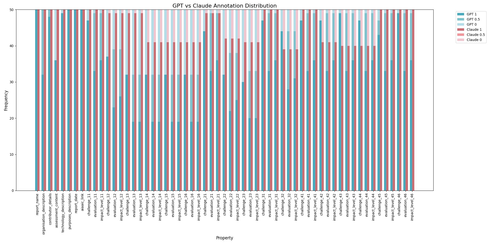
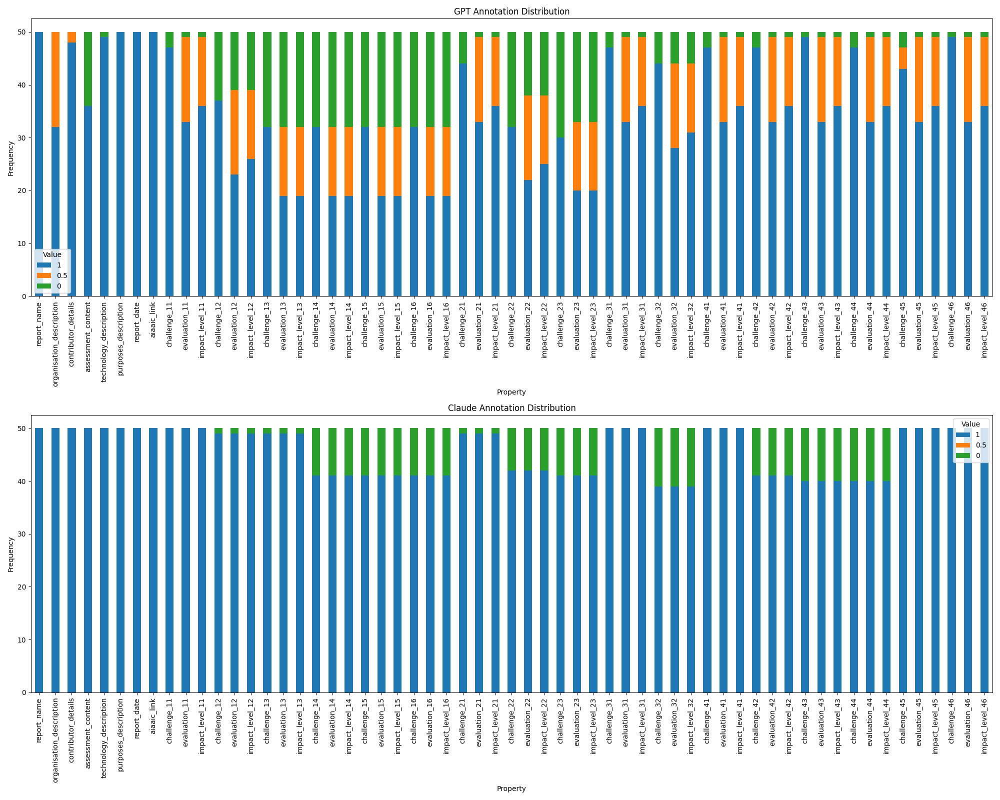
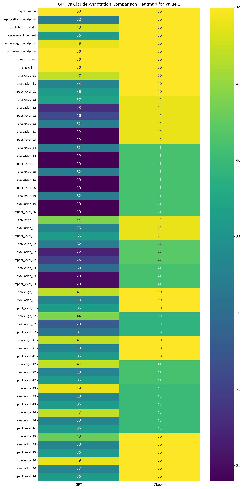
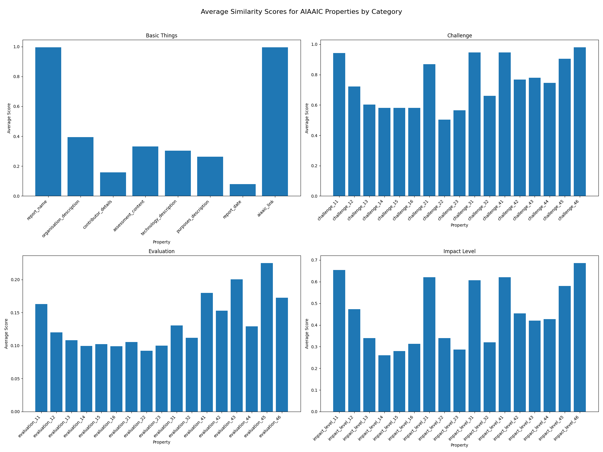
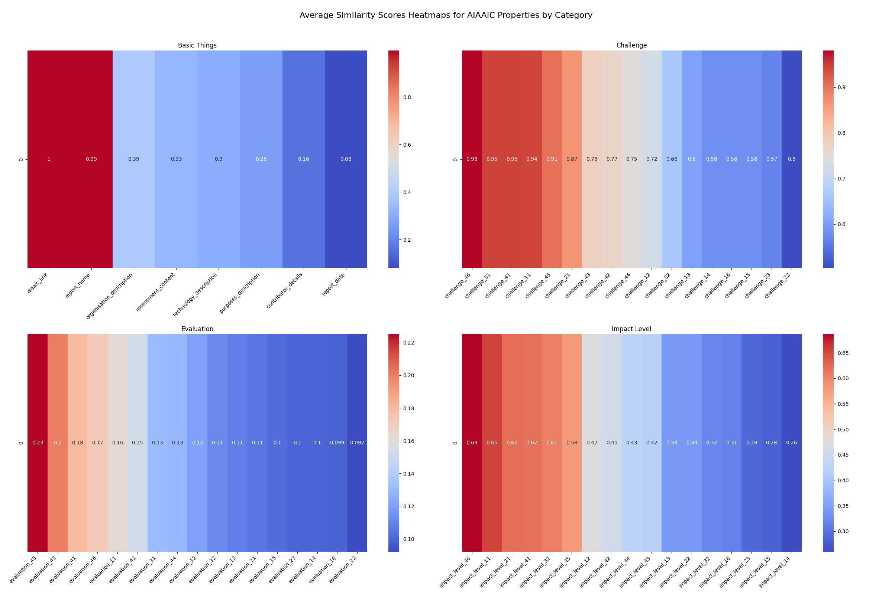
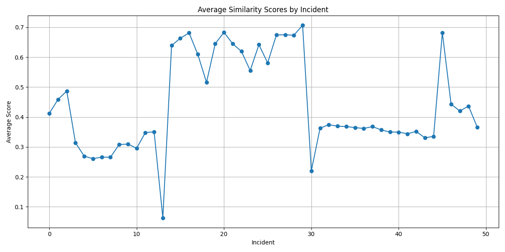

# FRIA Ontology
This repository contains the FRIA ontology, which is a formal representation of the [FRIA](https://aligner-h2020.eu/fundamental-rights-impact-assessment-fria/) report. The ontology design is in [```fria-report.ttl```](./fria-report.ttl), you can use the predefined [```prompt```](./prompt%20ver2.md)(latest version is 2) to generate the FRIA report in RDF format from AIAAIC data.
The source data is from [```ragnarok85's repo```](https://github.com/Julio-Noe/Protect_erap/blob/73ab99f29365b6d0de8a7ec6bc81fb07f7917935/AIAAIC%20corpus/AIAAIC_corpus-10-2023.csv), this dataset is processed by using [```process_text.py```](./process_text.py) and the processed data is in [```processed_data```](./processed_data.csv) file.

The 50 instances generated from Claude 3.5 Sonnet and ChatGPT 4o are in [```instances```](./instances) folder. Those instances are extracted to [```claude_extracted_data.csv```](./claude_extracted_data.csv) and [```gpt_extracted_data.csv```](./gpt_extracted_data.csv) using [python](./extract_data_fin.py).

## Evaluation
The evaluation is based on the [```laude_extracted_data.csv```](./claude_extracted_data.csv), [```gpt_extracted_data.csv```](./gpt_extracted_data.csv) and [```similarity_scores.csv```](./similarity_scores.csv) files. The similarity scores are calculated using [```similarity_scores.py```](./similarity_scores.py). The evaluation figures are generated using [```frequency.py```](./frequency.py) and [```ss_f.py```](./ss_f.py).









## About
This project is my dissertation project for the MSc in Computer Science at Trinity College Dublin. 